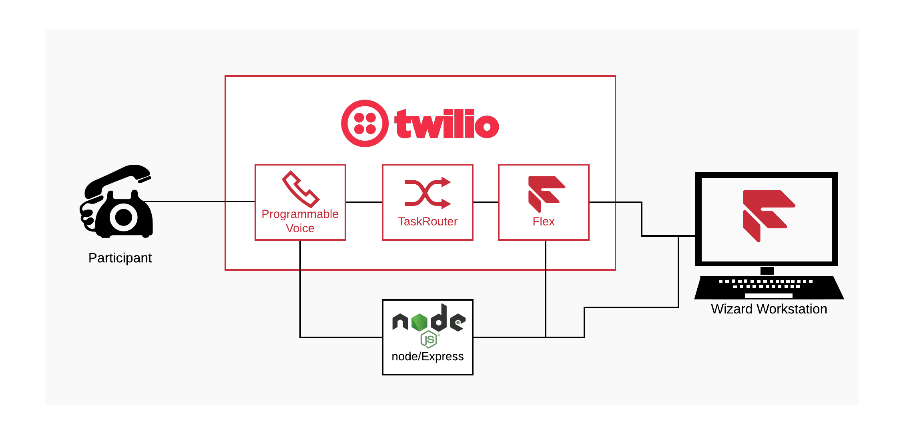

# IVR Usability Test Tool Example from SIGNAL 2020

This repository contains the sample code from the SIGNAL 2020 session *Usability Testing for your Conversational IVR*.  Please note that this isn't a complete product, the code is provided as an example of how such tools *could* be built by customising Twilio Flex.

To implement the tool, the following components are used:

1. A Flex Plugin to provide the researcher User Interface that controls the call
2. A basic Node/Express server application acting as the intermerdiary between Researcher and Caller
3. A Twilio Function to allow the Plugin to add the IVR call leg

___

# Setup Instructions
> Instructions for setting up to run the code will be added here.

# Call Flow definition format
The call flow that is executed is defined in the file `flowdef.json` which specifies the prompts to be used and transitions that are available. 

> Full details of the format of this file will be added here.